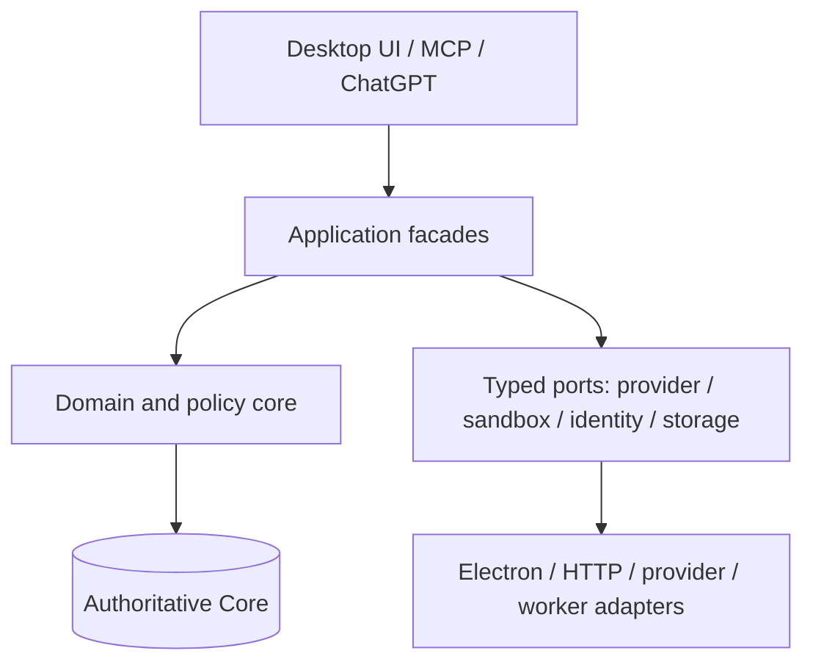

# Clarity Workflows — Handoff File 2

## Roadmap from completed Chunk 4 to the full Chunk 11 product

Handoff date: `2026-08-12`  
Baseline: `v0.6.0` private Chunk 4 candidate  
Status: **Chunk 4 implementation and private candidate verification complete; Chunk 5 is the next authorized product increment.**

This document supersedes the older `CLARITY_PROJECT_HANDOFF.md` as the forward roadmap while preserving its historical evidence and release boundaries. It is a planning companion to the v0.6.0 candidate, not a claim that the future chunks are already implemented.

## 1. Sources consulted and authority

This handoff was reconciled against:

- the previous Library `CLARITY_PROJECT_HANDOFF.md` (the v0.4.0 / Chunk 2 handoff);
- the current local `CLARITY_PROJECT_HANDOFF.md`;
- `CHATGPT_INTEGRATION_PLAN.md`, including its authoritative eleven-chunk roadmap and public-release path;
- `CLARITY_V0.6.0_CHUNK4_REPORT.md` and the eight historical Chunk 4 stage reports;
- the verified `Clarity-Workflows-v0.6.0-Chunk4-Source.candidate.zip` and its candidate-verification record.

The authoritative scope correction remains:

1. Chunk 2 is Complete Human Graph Workspace.
2. Chunk 3 is Real File and Dataset Ingestion.
3. Chunk 4 is Grounded Search, Retrieval and Provenance.
4. Chunk 5 begins the Visual Workflow Composer.

The old Chunk 1 report paragraph that called file ingestion “the next Chunk 2” is historical and superseded. It must not be used to reorder the roadmap.

### Tooling note

The requested aihero `improve-codebase-architecture` skill was not available in the active skill catalog. This document therefore applies the equivalent deep-module architecture rules explicitly: stable narrow interfaces, substantial hidden implementation, dependency inversion, one owner for each invariant, no framework leakage into domain code, and tests at module seams. When that skill becomes available, its checklist should be applied as a review against this document rather than silently treated as already executed.

## 2. Completed baseline: Chunks 1–4

| Chunk | Product boundary | Status |
|---:|---|---|
| 1 | Unified Clarity Core, durable graph/workflow entities, isolated Electron IPC, private MCP workflow, human approval | Delivered in v0.3.0; preserved and hardened |
| 2 | Complete Human Graph Workspace: projects, nodes, relationships, annotations, import/export, conflicts, archives, lifecycle | Delivered in v0.4.0 |
| 3 | Real File and Dataset Ingestion: managed bytes, explicit extraction, bounded MCP content, retry and integrity denial | Delivered in v0.5.0 through its two authorized stages |
| 4 | Grounded Search, Retrieval and Provenance: disposable search projection, exact passages, MCP retrieval, citation admission, bounded review presentation | **Complete as v0.6.0 private candidate** |

The v0.6.0 candidate passed the complete local release scope: root verification at 32 files / 205 tests, plugin aggregate at 25 files / 145 tests, white-box 37/37, black-box 1/1, gray-box 3/3, Chromium 149 compatibility, element integration, mutation at 67.79% against a 60% floor, zero production audit vulnerabilities, and two clean extractions. Candidate SHA-256:

```text
16850c572ba75f83965b04422d65bde044c15d6543ceb61ec9a6d017bd9bac82
```

The candidate is a private verified baseline, not a public final release. Native Electron `BrowserWindow` smoke and a real account-owned ChatGPT connection remain publication gates. Firefox and WebKit are not claimed.

### Non-negotiable contracts carried forward

- SQLite Clarity Core remains the one authoritative graph, workflow, run, approval, annotation, and artifact record.
- Derived indexes, caches, model outputs, and search projections never become authority merely because they are durable.
- Imported, extracted, generated, and approved content retains explicit origin and trust; no later layer launders provenance.
- Untrusted source text is data, never an instruction channel.
- A model or provider may propose work but cannot directly mutate the graph or certify its own result.
- Every durable mutation is revision-bound, validated, auditable, and recoverable.
- Staging and approval remain separate. Human approval is an explicit component-mediated boundary, not a model assertion.
- Unsupported, failed, pending, missing, changed, or tampered artifact bytes fail closed.
- Public hosting must not require customers to supply private tunnel IDs, personal API keys, or developer credentials.

## 3. Architecture law: deep modules

The target architecture is a small set of deep modules. Each module hides substantial policy, persistence, retries, validation, and failure handling behind a small typed facade. The objective is not to create many thin wrappers; it is to make each boundary meaningful and independently replaceable.



### Deep-module rules

1. **Small public surface, deep implementation.** A module exposes one purpose-built facade and typed request/response objects. Storage schemas, retry loops, provider SDK types, worker protocols, and UI state machines stay inside the module.
2. **Dependency direction is one-way.** UI, MCP, and ChatGPT adapters call application facades. Application code calls domain services and ports. Domain code does not import React, Electron, HTTP, provider SDKs, filesystem paths, or sandbox runtimes.
3. **Ports own variability.** AI providers, object storage, identity, queues, clocks, randomness, and sandbox runners are ports. Adapters implement them at the edge. Business policy never branches on a vendor SDK type.
4. **One owner per invariant.** Revision checks, citation integrity, gate policy, workflow validity, tenant authorization, artifact digest verification, and approval transitions each have one authoritative implementation. Callers ask the owner; they do not reproduce the rule.
5. **No leaky DTOs.** Boundary DTOs contain bounded, versioned data. SQLite rows, provider responses, DOM events, file paths, and access tokens do not cross domain boundaries.
6. **No shared mutable convenience state.** Use explicit commands, queries, immutable snapshots, and event records. In-process caches are disposable and invalidated by authoritative revision or digest.
7. **Seams are testable.** Every port has contract tests; every adapter has a small integration test; every high-risk policy has a white-box/property test; every vertical slice has one black-box journey.
8. **Deep modules earn their name.** A new module must hide meaningful complexity. A wrapper that only renames a call, re-exports a vendor type, or duplicates validation is rejected during review.
9. **Frameworks stay at the edge.** React, Electron, MCP SDK, HTTP, SQLite, provider clients, and worker/container APIs are replaceable details behind ports or adapters.
10. **Boundaries are versioned.** Workflow definitions, run events, artifact manifests, tool schemas, migrations, and public API contracts have explicit versions and compatibility tests.

### Proposed module ownership map

| Module | Owns | Stable facade | Must not own |
|---|---|---|---|
| Core domain | authoritative graph/workflow/run/approval state and revisions | `CoreCommandService`, `CoreQueryService` | UI state, provider calls, sandbox execution |
| Artifact module | managed bytes, extraction state, digest and retention | `ArtifactService` | model interpretation, tenant policy |
| Search module | disposable projection, query, exact passage and citation identity | `SearchService` | workflow approval or provider execution |
| Workflow module | versioned definitions, validation, compilation and run intent | `WorkflowService` | vendor SDKs, direct filesystem/process access |
| Gate module | pre-tool/post-tool policy, evidence admission, approval challenge semantics | `GateService` | model calls, UI rendering |
| Agent module | pure planning and typed proposed operations | `AgentPlanner` | durable mutation, network, secret access |
| Execution module | run state machine, idempotency, retries, budgets and event log | `ExecutionService` | arbitrary code execution, tenant login |
| Provider gateway | model/provider request normalization and response validation | `ProviderGateway` | business authorization, graph writes |
| Sandbox module | isolated dataset/code execution and output manifest | `SandboxService` | unrestricted host access, approval decisions |
| ChatGPT/MCP module | tool/resource contracts and app review bridge | `ClarityAppFacade` | direct database access, hidden authority |
| Identity/tenant module | OAuth, scopes, tenant isolation, token lifecycle | `IdentityService` | workflow semantics, provider prompts |
| Operations module | logs, metrics, traces, alerts, backups and rollout controls | `OperationsFacade` | product truth, ad hoc business decisions |

## 4. Software-entropy operating rules

These rules operationalize the pragmatic engineering principles associated with David Thomas and Andrew Hunt’s *The Pragmatic Programmer*. They are written as acceptance rules, not quotations.

| Entropy rule | Application to Clarity | Required evidence |
|---|---|---|
| **DRY: one piece of knowledge** | Schema limits, trust labels, gate policy, revision semantics, citation identity, and error codes have one owner. Generated DTOs or adapters derive from the owner. | Search for duplicated constants and validation; duplicate business rules are a release defect. |
| **Orthogonality** | UI, MCP transport, Core, providers, sandbox, and hosted identity change independently through typed seams. A provider change must not rewrite gate policy. | Dependency graph has no reverse-edge or framework-to-domain import. |
| **Broken windows** | No known failing test, stale report, ignored security warning, unowned TODO, flaky retry, or unexplained exception is accepted into a chunk baseline. | Clean verification output, warning review, and a closed issue list. |
| **Tracer bullets / thin vertical slices** | Each chunk begins with one real path through its intended boundary, then expands policy and scale around that path. | One black-box journey plus seam tests before broad feature work. |
| **Automate repetitive checks** | Formatting, typechecks, migration checks, contract tests, mutation, dependency audits, secret scans, inventory, and reproducible packaging run from scripts. | CI/local command is documented and repeatable from a clean extraction. |
| **Reversible decisions** | Provider, queue, identity, storage, and sandbox choices remain ports/adapters until production evidence justifies commitment. Schema changes use additive migrations and rollback/recovery plans. | ADR or decision record with reversal cost and exit signal. |
| **Feedback over prediction** | Instrument latency, failures, retries, token/cost budgets, sandbox resource use, user abandonment, and approval outcomes. | Metrics and dashboards exist before scaling claims. |
| **Make change easy** | Prefer explicit contracts, composition, generated clients, and small adapters over inheritance trees or global flags. | Change-impact review identifies owners and tests before merge. |
| **Prototype at the edge, preserve the core** | Provider/model experiments, UI prototypes, and ChatGPT transport experiments never alter authoritative Core semantics without a reviewed contract change. | Prototype data is isolated and cannot masquerade as production evidence. |

### Entropy budget and release thresholds

Every chunk must report these measures. A threshold breach blocks the chunk exit until it is corrected or explicitly waived in an ADR.

- dependency cycles across domain/application modules: **0**;
- direct provider, Electron, HTTP, React, or sandbox imports from domain modules: **0**;
- unowned duplicate policy constants or error meanings: **0**;
- skipped, quarantined, or flaky required tests: **0**;
- unresolved security or data-integrity warnings in changed code: **0**;
- unbounded public DTO fields, raw provider payloads, or caller-supplied provenance: **0**;
- authoritative writes outside the Core command boundary: **0**;
- migrations without forward/restart/corruption tests: **0**;
- release-scope TODOs or dead feature flags: **0**;
- mutation score: project threshold, initially **at least 60%**, with changed high-risk policy modules reviewed separately;
- every new module: one owner, one facade, contract tests, and an explicit deletion/rollback path.

## 5. Roadmap: Chunk 5 through Chunk 11

### Chunk 5 — Visual Workflow Composer

**Purpose:** turn the fixed private workflow into a human-editable, versioned workflow definition without executing it yet.

**Deep modules:** `WorkflowDefinitionService`, `WorkflowSchema`, `WorkflowCompiler`, and a renderer adapter. The compiler produces a deterministic, validated intermediate representation. The renderer edits commands through the application facade; it never writes workflow tables directly.

**Deliverables:**

- versioned workflow-definition schema with node, edge, input, output, policy, and capability declarations;
- visual editor for composing, naming, cloning, versioning, and archiving definitions;
- static validation for cycles, unreachable nodes, missing inputs, type mismatches, forbidden capabilities, and unbounded fan-out;
- deterministic serialization and migration from the fixed Chunk 1 workflow;
- dry-run plan preview that shows proposed steps and required approvals without calling a provider;
- audit events for definition creation, edit, publish, archive, and restore.

**Non-goals:** model execution, arbitrary code, external provider calls, hosted accounts, or silently changing the existing approval contract.

**Acceptance:** one real workflow can be created in the desktop UI, saved/reopened/revisioned, validated identically through Core and MCP, exported/imported without authority laundering, and previewed as a deterministic plan. Invalid graphs fail before persistence. Restart and migration tests pass.

**Entropy exit:** no UI-specific workflow rules, no duplicate compiler in MCP, no direct SQLite access from the renderer, no unversioned definition fields, and no new public tool without a contract test.

### Chunk 6 — Two Gates and Pure Agent

**Purpose:** productize the two-gate safety model and introduce an agent planner that is pure, bounded, and unable to mutate the graph.

**Deep modules:** `GateService`, `EvidencePolicy`, `AgentPlanner`, `PlanValidator`, and a deterministic replay harness. The planner receives an immutable context snapshot, workflow IR, policy, and clock/seed inputs; it returns typed proposed operations and reasoning metadata.

**Deliverables:**

- reusable pre-tool source/context gate and post-tool ontology/evidence gate;
- typed gate decisions with denial reasons, required evidence, confidence bounds, and policy version;
- pure agent planner with no database, network, filesystem, process, or secret capability;
- bounded proposal format: operation type, target identity, evidence references, assumptions, counterarguments, and unresolved questions;
- deterministic replay and golden fixtures for the same input/policy/version;
- explicit staging boundary so planner output can never become an approved result directly.

**Non-goals:** real model calls, arbitrary tools, sandbox execution, auto-approval, or provider-specific prompt logic.

**Acceptance:** identical input produces identical plan under a fixed seed; malformed or unsupported proposals are rejected before staging; gates deny missing, stale, untrusted, or out-of-scope evidence; a human can inspect the plan and approval remains required. Fuzz/property tests cover bounds and identity binding.

**Entropy exit:** all gate policy lives in one module, agent code imports only ports-free domain DTOs, and no caller can supply evidence body/provenance that Core should derive.

### Chunk 7 — Real AI Execution

**Purpose:** execute approved workflow plans through real model providers while retaining the pure-agent and human-approval boundaries.

**Deep modules:** `ExecutionService`, `RunStateMachine`, `ProviderGateway`, `PromptAssembler`, `BudgetPolicy`, and `RunEventStore`. Provider adapters translate vendor APIs to a canonical response; they do not decide authorization or commit graph mutations.

**Deliverables:**

- provider-neutral request/response contract with model, capability, timeout, token/cost, and safety metadata;
- provider adapters with secret isolation, request redaction, rate-limit handling, cancellation, timeout, retry, and idempotency;
- durable run state machine: `planned → gated → running → awaiting_review → committed|rejected|failed|cancelled`;
- append-only run events with resumable checkpoints and deterministic run digest;
- budget and policy enforcement before provider invocation and during streaming;
- output normalization into a staged candidate, never a direct graph write;
- replay fixtures using recorded responses with credentials removed.

**Non-goals:** executing arbitrary user code, broad network access, hosted multi-tenancy, or treating model confidence as approval.

**Acceptance:** a real provider call can be started, cancelled, retried idempotently, resumed after restart, and rendered for human review. Provider failure cannot leave a false committed result. Cost/token/time budgets are enforced. Secrets never appear in Core, logs, MCP text, or exported workspace data.

**Entropy exit:** provider SDK types are contained in adapters; one run state machine owns transitions; retry/idempotency rules are not copied into each provider; model output remains untrusted until gates and approval pass.

### Chunk 8 — Dataset and Code Execution Sandbox

**Purpose:** execute approved data transformations and code in an isolated, bounded environment with reproducible provenance.

**Deep modules:** `SandboxService`, `WorkerProtocol`, `DatasetSnapshotService`, `ResourcePolicy`, and `OutputManifest`. The execution worker has no authority to mutate Core; it returns a typed result manifest to the execution module.

**Deliverables:**

- immutable input dataset snapshots identified by content digest and workflow/run revision;
- isolated worker boundary with read-only mounts, explicit output directory, CPU/memory/time/process/file-size limits, cancellation, and cleanup;
- default-deny network and capability policy with explicit reviewed exceptions;
- language/runtime image or environment manifest pinned by digest;
- structured stdout/stderr limits and machine-readable output manifest;
- output validation, malware/content scanning hooks, provenance links, and human-readable result summary;
- adversarial fixtures for path traversal, symlink escape, resource exhaustion, prompt injection in data, and output forgery.

**Non-goals:** unrestricted shell access, host filesystem access, ambient credentials, persistent worker state, or sandbox approval of its own output.

**Acceptance:** a bounded dataset/code task runs in a fresh worker, produces a reproducible manifest, fails closed on limit violations, survives cancellation/restart without orphan authority, and cannot reach the host or network outside policy. The result remains staged until the two gates and human review succeed.

**Entropy exit:** sandbox policy has one owner; worker protocol is versioned; no UI or provider adapter constructs shell commands; every output is linked to exact input, image, code, and policy digests.

### Chunk 9 — Full Clarity Inside ChatGPT

**Purpose:** make the completed desktop/Core/workflow/agent/execution/sandbox path usable inside ChatGPT through a production-quality MCP Apps experience.

**Deep modules:** `ClarityAppFacade`, `McpContractRegistry`, `ReviewBridge`, `ConversationRunSession`, and `ConnectionHealth`. The ChatGPT adapter consumes application DTOs and never opens SQLite or bypasses gates.

**Deliverables:**

- cohesive tool/resource surface for workflow discovery, plan preview, context admission, execution status, sandbox outputs, citation rendering, review, approval, rejection, and restart/resume;
- app-only approval bridge with explicit human gesture, challenge expiry, stale-view handling, and truthful typed errors;
- bounded UI state machine for loading, pending, failed, stale, review, committed, and rejected states;
- live account-owned connection refresh/rebind procedure and real ChatGPT conversation verification;
- tool/schema compatibility matrix and version negotiation;
- cross-surface E2E journey: desktop definition → ChatGPT plan → gates → provider → sandbox → review → approval → durable Core result → desktop refresh.

**Non-goals:** public tenant hosting, OAuth for unrelated providers, or relaxing human approval to improve convenience.

**Acceptance:** a real account-owned ChatGPT connection exposes the intended current tools and component, completes the full journey, preserves one Core identity, recovers from restart/stale views, and produces no unauthorized graph mutation. Browser, native Electron, accessibility, and prompt-injection suites pass for the release target.

**Entropy exit:** the ChatGPT surface is an adapter, not a second application domain; tool count/schema changes are generated or centrally registered; no app-only operation is model-callable.

### Chunk 10 — Hosted Public System and OAuth

**Purpose:** replace private local/tunnel assumptions with a secure hosted service that can support multiple tenants and account-owned ChatGPT connections.

**Deep modules:** `TenantService`, `IdentityService`, `OAuthBroker`, `HostedCoreGateway`, `ObjectStoreGateway`, and `TenantOperations`. Control-plane identity and data-plane workflow execution communicate through typed, authenticated contracts.

**Deliverables:**

- tenant-isolated authoritative data and artifact storage with explicit tenant keys and authorization checks;
- OAuth authorization-code flow, least-privilege scopes, consent records, token encryption, rotation, revocation, expiry, and audience validation;
- hosted MCP endpoint with HTTPS, origin/auth checks, request limits, rate limits, abuse controls, and per-tenant quotas;
- database/object migrations, export, deletion, retention, backup, restore, and tenant offboarding workflows;
- server-side secret management and provider credential isolation;
- audit trail for identity, consent, tool calls, workflow runs, approvals, artifact access, and administrative actions;
- staging environment that mirrors production topology without production data.

**Non-goals:** public launch before Chunk 11 gates, cross-tenant analytics without explicit aggregation policy, or client-held service secrets.

**Acceptance:** tenant A cannot observe or affect tenant B under direct, concurrent, stale-token, object-path, and failure tests. OAuth scopes are enforced at every sensitive operation. Backup restore, deletion/export, rotation/revocation, and migration rehearsals pass. Hosted and local Core semantics remain aligned.

**Entropy exit:** tenant policy has one owner, authorization is not duplicated in every handler, provider/storage vendors remain adapters, and operational state is observable without becoming product authority.

### Chunk 11 — Production Hardening and Public Release

**Purpose:** convert the hosted and desktop product into an operable, supportable, secure public release.

**Deep modules:** `ReleaseOrchestrator`, `CompatibilityMatrix`, `ThreatModelControls`, `OperationsFacade`, and `SupportDiagnostics`. Product modules remain unchanged unless a measured release defect requires a reviewed patch.

**Deliverables:**

- end-to-end threat model refresh covering prompt injection, confused deputy, artifact tampering, OAuth abuse, tenant escape, sandbox escape, supply chain, replay, and denial of service;
- SLOs/SLIs for tool latency, run completion, approval latency, error rates, queue depth, sandbox failures, and data durability;
- structured logs, traces, metrics, redaction, alert thresholds, on-call runbooks, incident response, and audit retention;
- load, soak, recovery, chaos, migration, backup/restore, deletion, and rollback tests;
- full Chromium/Firefox/WebKit compatibility as supported, native Electron smoke on release hosts, and accessibility verification;
- signed desktop installers, reproducible build attestations, dependency/SBOM/provenance checks, vulnerability response, and update-channel rollback;
- staged rollout: internal → canary → limited public → general availability, with explicit abort criteria;
- final documentation, user-facing security/privacy boundaries, support diagnostics, and release archive procedure.

**Non-goals:** adding new product capabilities during hardening unless they are separately authorized and do not invalidate the release baseline.

**Acceptance:** the complete journey succeeds under clean, stale, restarted, failed, malicious, rate-limited, and concurrent conditions; no critical/high release defect remains open; recovery objectives are demonstrated; signed artifacts and manifests verify; rollback is rehearsed; and the public ChatGPT connection uses the hosted OAuth path rather than a private tunnel or personal credential.

**Entropy exit:** release scope is frozen, all known warnings are resolved or explicitly accepted, architecture cycles remain zero, and the final archive contains the exact report that passed its own clean-extraction gates.

## 6. End-to-end target journey

The full product path should be proven as one traceable journey by Chunk 11:

1. A human creates/version-controls a workflow in the Chunk 5 composer.
2. Chunk 6 validates the plan, admits bounded evidence, and produces a pure proposal.
3. Chunk 7 invokes a real provider through a typed gateway and records resumable events.
4. Chunk 8 executes approved data/code work in an isolated worker and emits a digest-bound manifest.
5. Chunk 9 exposes status, citations, outputs, and review inside ChatGPT while preserving the same Core identity.
6. Chunk 10 authenticates the tenant and ChatGPT connection through OAuth and enforces isolation.
7. Chunk 11 proves the journey under production security, recovery, scale, compatibility, rollout, and rollback gates.

At no step may a model, provider, sandbox, browser, or MCP caller directly certify or persist an approved graph result.

## 7. Per-chunk delivery protocol

Every future chunk uses the same bounded loop:

1. Write a one-page contract: scope, non-goals, invariants, threat model, owner modules, migrations, and rollback.
2. Build one tracer-bullet vertical slice through the real boundary.
3. Add domain, seam, black-box, failure, restart, concurrency, and security tests.
4. Run entropy checks: dependency graph, duplicate knowledge, public API growth, warnings, TODOs, and changed-module mutation.
5. Add observability before claiming scale or reliability.
6. Update the stage report and this handoff with exact evidence and remaining boundaries.
7. Package only from a clean extraction after the report authorizes it.
8. Stop at the chunk boundary. New capability belongs in the next authorized chunk, not in a “small” cross-cutting patch.

### Required chunk exit record

Each exit record must include:

- implementation boundary and explicit non-goals;
- schema/API/migration versions and compatibility policy;
- module ownership and dependency-graph result;
- white-box, seam, black-box, failure, restart, concurrency, browser/native, and security counts;
- mutation and dependency-audit results;
- entropy budget results and accepted ADRs;
- reproducible build/package hashes where applicable;
- known unrun environments and claims deliberately not made;
- next authorized chunk and the exact risks it inherits.

## 8. Immediate next work

Chunk 4 is closed as the verified private baseline. The next work item is **Chunk 5 — Visual Workflow Composer**. Start with the workflow-definition contract, compiler/validator facade, migration from the fixed private workflow, and one desktop vertical slice. Do not begin provider execution, sandboxing, hosted identity, or public distribution inside Chunk 5.

The v0.6.0 candidate and verification record are saved in Library. The candidate remains private until the native Electron and real account-owned ChatGPT publication gates are completed; those gates do not change the authorization boundary for beginning Chunk 5 design work.
